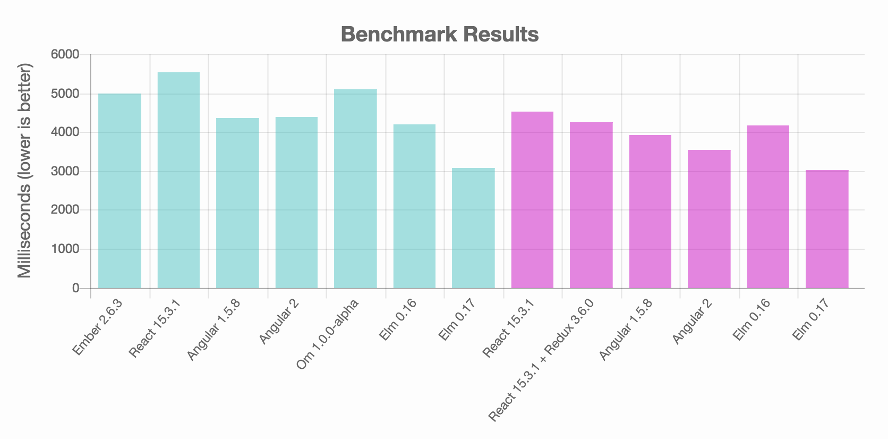

# Oficina de Elm
<hr />
<h4 class="subtitle">por Roberto Soares & Rogério Chaves</h4>


Note: apresentação

---

## Agenda

* Linguagem
* Arquitetura
* Tipos
* Interoperabilidade
* Escalando

---

## Linguagem
## Elm?

----

## Linguagem Funcional

Esqueça o que escutou sobre funcional!

Note: esqueça: termos difíceis, idéias estranhas, ferramentas ruins

----

## Compila para JavaScript

Foco: Front-end

----

## Compilador como Assistente

Melhores mensagens de erro!

```sh
The branches of this `if` produce different types of values.

3|>  if n < 0 then
4|>  "erro!"
5|>  else
6|>  2

The `then` branch has type:

    String

But the `else` branch is:

    number

Hint: These need to match so that no matter which branch we take,
we always get back the same type of value.
```
<!-- .element: class="stretch" -->

----

## Rápido



<small>[Fonte](http://elm-lang.org/blog/blazing-fast-html-round-two)</small>

Note: esqueça: termos difíceis, idéias estranhas, ferramentas ruins

----

```elm
import Html exposing (Html, button, div, text)
import Html.App as App
import Html.Events exposing (onClick)

main =
  App.beginnerProgram { model = 0, view = view, update = update }

type Msg = Increment | Decrement

update msg model =
  case msg of
    Increment ->
      model + 1

    Decrement ->
      model - 1

view model =
  div []
    [ button [ onClick Decrement ] [ text "-" ]
    , div [] [ text (toString model) ]
    , button [ onClick Increment ] [ text "+" ]
    ]
```
<!-- .element: class="stretch" -->

Note: exemplo de código

